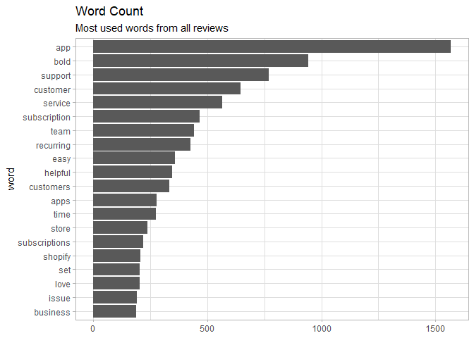
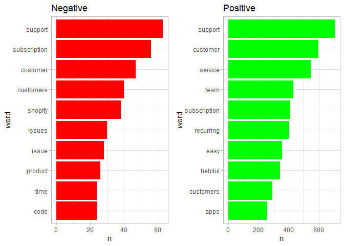
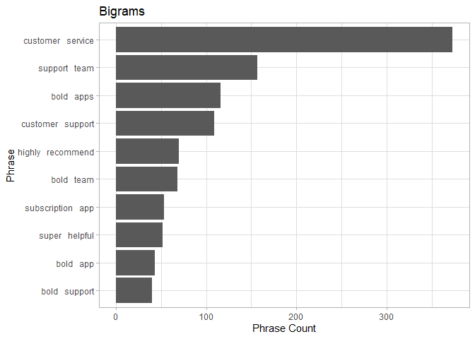
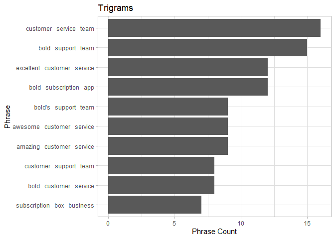
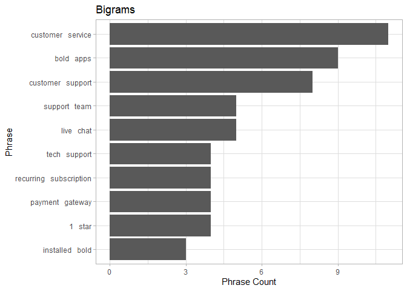

## Outline

This project is an study on the reviews from the Bold Commerce subscription app on Shopify. The reviews were scraped on 27-05-2020. 

The objective of this study is to glean an understanding into what customers are saying about the app, in an effort to identify an areas where the app is succeding and where it could be improved. 


## First Steps

Libraries required:

```r
library(tidyverse)
library(tidytext)
```

Initial Theme Set:

```r
theme_set(theme_light())
```


## EDA

Let's first read in our data files. These data files were scraped directly from the shopify review pages for the Bold Commerce subscription app. The reviews were cleaned in the data_cleaning.R file. The clean data is what we will be working with. 


```r
scraped_reviews_clean <- readRDS("scraped_reviews_clean.RDS")

scraped_reviews_clean %>% head(5) %>% knitr::kable(col.names = c(" Page Number", 
    "Stars", "Date Posted", "Review", "Review ID"))
```


  Page Number   Stars  Date Posted   Review                                                                                                                                                                                                                                                                                                                                                                                    Review ID
-------------  ------  ------------  ---------------------------------------------------------------------------------------------------------------------------------------------------------------------------------------------------------------------------------------------------------------------------------------------------------------------------------------------------------------------------------------  ----------
            1       2  2020-05-27    We have had the app for over a month now. We have had multiple issues with the app. The chat service is there but not able to resolve most issues . They have to be escalated and then may get a delayed response. We have had issues since the launch of our subscription that has still not been resolved. I would be prepared for issues if you have a more than a few subscribers.            1
            1       5  2020-05-27    Great app with awesome support. Quick to answer my questions anytime I reach out. Lots of Customization options. Thanks Priyanka for helping make my store checkout user friendly.                                                                                                                                                                                                                2
            1       5  2020-05-26    Great app, generally easy to use, lots of functionality. Excelent service (especially Aryan) that's right in the app, and quite responsive!                                                                                                                                                                                                                                                       3
            1       5  2020-05-26    I was having trouble installing it, then reached out to customer service. Carter helped me along with answering some of my questions regarding subscription. thank you so much!                                                                                                                                                                                                                   4
            1       5  2020-05-26    Great customer service. So easy to use, and analytics are fantastic.  Super simple to set up. I'd recommend it to anyone with a consumable product, and I will use it again... for sure.                                                                                                                                                                                                          5


We have  ``1644`` unqiue reviews, with the first review issued at ``2015-01-23`` and the newest review, as of time of scraping, posted on ``2020-05-27``


Lets see what the distribution is for ratings. 


```r
scraped_reviews_clean %>% count(stars) %>% knitr::kable(caption = "Count of stars", 
    col.names = c("Stars", "Count"))
```


Table: Count of stars

 Stars   Count
------  ------
     1      57
     2      14
     3      23
     4      84
     5    1466

We can clearly see that the vast majority of reviewers thought that the app was worthy of the top rating available. 


This is interesting, but lets see if we can tease out the some more insights from these reviews. We do this by taking the reviews the scraped reviews and using the ```tidytext``` package to transform them into a usable form. This results in the reviews being broken down into a tidy dataset that can be counted, grouped and analyzed. This has been done in the cleaning script located in the github. We will read in this tidy data set. 


```r
tidy_reviews <- readRDS("tidy_reviews.RDS")


tidy_reviews %>% head(10) %>% knitr::kable(col.names = c("Page Number", "Stars", 
    "Date Posted", "Review ID", "Word"))
```


 Page Number   Stars  Date Posted    Review ID  Word      
------------  ------  ------------  ----------  ----------
           1       2  2020-05-27             1  app       
           1       2  2020-05-27             1  month     
           1       2  2020-05-27             1  multiple  
           1       2  2020-05-27             1  issues    
           1       2  2020-05-27             1  app       
           1       2  2020-05-27             1  chat      
           1       2  2020-05-27             1  service   
           1       2  2020-05-27             1  resolve   
           1       2  2020-05-27             1  issues    
           1       2  2020-05-27             1  escalated 


We've taken the review text for all reviews; broken them into single words, removed puncuation, and converted everything into lowercase. We've placed these words into a ```word``` column replacing the previous ```review```  column from the ```scraped_reviews_clean``` dataset. We've also removed stop words from the ```tidy_text``` data set. Stop words are common words that are in lots of different sentances. Words such as "the", "a", "an" or "in", are examples of these. Were we to leave these types of words, they would dominate any further analysis that we would do. 


Let take a look at our most common words from all reviews


```r
tidy_reviews %>% count(word, sort = TRUE) %>% head(20) %>% mutate(word = reorder(word, 
    n)) %>% ggplot(aes(word, n)) + geom_col() + coord_flip() + ylab(NULL) + labs(title = "Word Count", 
    subtitle = "Most used words from all reviews")
```

<!-- -->

Looking at this chart we can see some positive insights. Words like easy, helpful and love are being used quite frequently. 
This chart can be misleading though. Because of the prevalance of 5 star reviews, we would expect an over representation of positive words in this chart. We can try and tease out some insights into the more negative reviews by seperating the negatively reviews from the positive reviews. We can use the ```star``` rating to do this. Lets group our reviews into 2 groups. The ```negative``` group represented by ```star``` ratings of 1,2 & 3. Our ```positive``` group will be represented by ```star ``` ratings of 4 and 5. We have also removed words ```bold``` and ```app```. These words were common, and can be considered stop words for this excerise. 


```r
tidy_grouped <- tidy_reviews %>% mutate(review_group = as.factor(if_else(stars %in% 
    c(1, 2, 3), "negative", "positive")))

p_grouped_positive <- tidy_grouped %>% filter(review_group == "positive", !word %in% 
    c("app", "bold")) %>% count(word, sort = TRUE) %>% head(10) %>% mutate(word = fct_reorder(word, 
    n)) %>% ggplot(aes(word, n)) + geom_col(fill = "green") + coord_flip() + labs(ylab = "Count", 
    title = "Positive")


p_grouped_negative <- tidy_grouped %>% filter(review_group == "negative", !word %in% 
    c("app", "bold")) %>% count(word, sort = TRUE) %>% head(10) %>% mutate(word = fct_reorder(word, 
    n)) %>% ggplot(aes(word, n)) + geom_col(fill = "red") + coord_flip() + labs(ylab = "Count", 
    title = "Negative")

gridExtra::grid.arrange(p_grouped_negative, p_grouped_positive, ncol = 2)
```

<!-- -->

Looking at these two graphs, we can clearly a dichotomy. The positive reviews contained words such as easy and helpful. Looking at our negative reviews, we see issue(s) pop up frequently. 

Interestingly we don't see an outright negative in the same way that we see outright positives such as easy and helpful. Perhaps this is because some words are preceded by qualifiers such as **not**. We will explore this in the next section. 


## N Grams

N grams are in essence phrase counts. In the previous section we looked at the count of a singular word. N grams take this one step further by taking multiple words together and counting them. 


We use the following code to build out our bi-grams and tri-grams.


```r
bigram <- scraped_reviews_clean %>% unnest_tokens(bigram, review_text, token = "ngrams", 
    n = 2)

bigram_sep <- bigram %>% separate(bigram, c("word1", "word2"), sep = " ")
```


```r
trigram <- scraped_reviews_clean %>% unnest_tokens(trigram, review_text, token = "ngrams", 
    n = 3)


trigram_sep <- trigram %>% separate(trigram, c("word1", "word2", "word3"), sep = " ")
```

The same problem with stop words arrises in n-grams as does when we look at single words. We can solve this by removing stop words once again. 


```r
stopwords <- stop_words$word

bigram_sep %>% filter(!word1 %in% stopwords) %>% filter(!word2 %in% stopwords) %>% 
    count(word1, word2, sort = TRUE) %>% mutate(joined = paste(word1, " ", word2), 
    joined = reorder(joined, n)) %>% head(10) %>% ggplot(aes(joined, y = n)) + geom_col() + 
    coord_flip() + labs(title = "Bigrams", y = "Phrase Count", x = "Phrase")
```

<!-- -->

```r
trigram_sep %>% filter(!word1 %in% stopwords) %>% filter(!word2 %in% stopwords) %>% 
    filter(!word3 %in% stopwords) %>% count(word1, word2, word3, sort = TRUE) %>% 
    mutate(joined = paste(word1, " ", word2, " ", word3), joined = reorder(joined, 
        n)) %>% head(10) %>% ggplot(aes(joined, y = n)) + geom_col() + coord_flip() + 
    labs(title = "Trigrams", y = "Phrase Count", x = "Phrase")
```

<!-- -->

Looking at both our bi and tri-grams we can see a very positive reception to the app. Phrases such as ***super helpful*** and *** amazing customer service*** are prevelant. We would expect positive messages like these to dominate this analysis as we saw that the vast majority of reviews were highly positive. 


Lets filter out those positive messages, and only look at the negatives. This will give us an understanding of what issues we are seeing arrise in the negative messages. We can use the same methadology as the singular word reivew, by assuming that a star rating of 3 or less indicates a negative review. 


```r
bigram_sep %>% filter(!word1 %in% stopwords, !word2 %in% stopwords, stars %in% c(1, 
    2, 3)) %>% count(word1, word2, sort = TRUE) %>% mutate(joined = paste(word1, 
    " ", word2), joined = reorder(joined, n)) %>% head(10) %>% ggplot(aes(joined, 
    y = n)) + geom_col() + coord_flip() + labs(title = "Bigrams", y = "Phrase Count", 
    x = "Phrase")
```

<!-- -->

The issue with filtering to the negative reviews only is that because there are so few of them, our analysis will be limited. That said, we do see that 5 seperate negative reviews mentioned tech support and live chats within their reviews. It may be worth while for Bold Commerce to take a look at these reviews to gain an understanding as to why these aspects of the app were mentioned with the negative reviews. 


## Word Cloud

Word clouds are hot right now. They are an easy way to visualize text. Lets take a look at a word cloud generated from these reviews.


```r
library(wordcloud2)


tidy_review_word_count <- tidy_reviews %>% filter(!word %in% c("bold", "app"), !str_detect(word, 
    "^[0-9]+$")) %>% count(word, sort = TRUE)

set.seed = 1234
wordcloud2(tidy_review_word_count, shape = "circle")
```

<!--html_preserve--><div id="htmlwidget-23858b79b56d65a7b8ea" style="width:672px;height:480px;" class="wordcloud2 html-widget"></div>
<script type="application/json" data-for="htmlwidget-23858b79b56d65a7b8ea">{"x":{"word":["support","customer","service","subscription","team","recurring","easy","helpful","customers","apps","time","store","subscriptions","shopify","set","love","issue","business","helped","questions","recommend","awesome","super","issues","product","amazing","quick","quickly","chat","products","brenden","install","site","experience","installed","features","code","highly","excellent","cody","happy","fast","running","guys","process","responsive","lot","day","helping","simple","people","offer","installation","setup","theme","company","free","functionality","website","days","friendly","started","fix","job","fantastic","update","live","feature","fixed","box","manage","options","staff","email","answered","month","option","patient","add","online","extremely","forward","carter","bold's","liquid","setting","answer","care","review","sales","found","hours","couple","huge","makes","months","priyanka","solution","question","nice","user","discount","monthly","received","system","tech","top","change","start","coffee","stars","integration","understand","based","cart","figure","victoria","minutes","page","payment","easily","leanne","perfect","pretty","respond","step","call","checkout","future","installing","provided","revenue","worth","build","kevin","shop","times","absolutely","custom","customization","response","shipping","impressed","launched","phone","simply","week","account","aryan","bit","pay","platform","clients","create","easier","feel","payments","resolved","sell","technical","billing","professional","recommended","run","solved","sukh","brad","chintan","customize","level","loving","naman","recharge","resolve","star","assistance","coding","emails","money","seamless","told","trial","wait","extra","harpreet","model","price","provide","real","recently","special","continue","excited","kelsey","life","multiple","perfectly","prompt","contacted","developers","due","incredible","knowledgeable","request","solve","specific","subscribe","added","contact","correctly","cost","entire","follow","hard","incredibly","interface","outstanding","person","subscribers","ability","adding","commerce","guri","lots","morgan","notch","offers","check","weeks","application","complete","developer","ease","efficient","immediately","items","launch","patience","program","purchase","shout","software","steps","wonderful","additional","amount","flexibility","grow","integrated","manually","settings","stores","timely","allowed","answers","codes","flexible","hands","hour","initial","offering","pleased","responded","walked","confusing","delivered","implement","information","major","rajni","services","sign","solutions","spoke","starting","test","answering","club","corey","date","decided","discounts","fixing","glad","guy","integrate","literally","offered","owner","past","powerful","properly","regular","reply","rock","saved","sharma","switched","access","appreciated","button","charge","client","control","creating","means","nir","quality","raj","reach","ready","reoccurring","reviews","save","simran","spend","stripe","totally","assist","auto","coming","cool","design","disappointed","enjoy","error","expected","fairly","hope","manner","membership","ran","requests","send","short","smoothly","solid","specifically","spent","stuck","talked","thinking","write","assisted","boxes","brilliant","built","buy","current","daniel","exceptional","james","learn","leave","line","lost","loyalty","lucas","migration","moving","reached","reason","rebecca","remove","required","rest","robb","ron","rony","satisfied","shoutout","stay","success","takes","ticket","trouble","users","widget","world","allowing","automated","automatically","base","bugs","changed","class","credit","deal","front","function","gateway","helps","instructions","intuitive","mention","paypal","positive","responses","seamlessly","selling","shopping","sorted","switch","web","addition","ago","basic","choose","clifford","complicated","concerns","correct","downloaded","existing","experienced","finally","increase","initially","knowing","looked","loved","management","matter","plan","rate","regina","robust","sarah","scott","single","stuff","switching","talk","understanding","vighnesh","weekly","wow","wrong","alexa","ankur","attentive","automatic","backend","bad","beginning","biggest","buying","cancel","card","charged","communication","data","difficult","ecommerce","expect","fit","food","gift","grace","honestly","idea","income","kaiser","managing","mayank","melody","period","phenomenal","poor","pricing","purchases","rating","read","remember","taylor","terms","thousands","tickets","track","updates","updating","waiting","addressed","basis","brendan","called","changing","chris","close","companies","completed","completely","configure","coupon","created","details","explain","explained","feedback","functions","giving","graeme","growth","guide","http","integrating","inventory","jennifer","jevon","key","knowledge","left","market","max","minor","mohammad","promptly","receive","representative","results","ship","speed","touch","wine","assisting","basically","braintree","building","businesses","cashier","ceo","dashboard","directly","friday","functional","glitches","growing","happened","happier","importantly","impressive","included","individual","integrates","item","laurel","load","loyal","match","met","minute","move","named","navigate","pages","paying","pleasure","previously","queries","regularly","reliable","requested","smooth","standard","straightforward","successful","technology","terrific","thankful","tier","unique","address","admin","analytics","baby","begin","bill","boldapps","bring","caused","chose","confident","convenient","css","customizations","customized","decent","decision","delivery","development","door","effective","efficiently","effort","emailed","enter","figured","figuring","finding","focus","forget","game","guess","half","handle","handled","hassle","hero","hesitate","hundreds","im","jordan","keeping","late","launching","learning","main","marketing","merchant","migrate","mind","original","paid","partner","pets","polite","pre","provider","rahul","reporting","requires","research","ro","rocks","samantha","saves","savvy","sites","slow","snigdha","solving","sort","straight","stream","superior","supported","taking","testing","trust","tweak","tweaks","type","uninstalled","ups","walk","wizard","absolute","accounts","accurate","action","adjust","arvinder","aspects","brand","breeze","brenda","buttons","carts","challi","cheers","consistent","constantly","courteous","customizing","delete","deleted","difference","dog","dollars","download","dylan","effectively","encountered","ensure","expensive","expert","favorite","fine","folks","friends","gateways","glitch","grateful","hand","happening","heard","hit","holiday","illuminati","improve","info","it’s","julian","limitations","list","log","lose","meal","memberships","missing","monday","moved","nightmare","notifications","numerous","organic","originally","owners","patiently","paul","plugin","previous","prior","programming","providing","reaching","recent","refund","rep","repeat","resolving","samuel","saver","saving","sense","sets","speak","stellar","stepped","story","stress","strong","styling","superb","swap","term","ton","tons","tool","total","tracking","transition","true","ui","video","win","abhi","actual","adds","adjustments","advertised","advice","alternative","anytime","attention","awful","brainer","brendon","brett","broke","bug","buggy","busy","capture","changer","checking","choice","click","communicate","complex","confidence","continued","continuing","convenience","costs","critical","customise","customizable","daily","deliver","detailed","difficulty","discovered","documentation","downloading","dream","drop","edit","editing","exact","exotic","experiences","express","fee","flow","greatly","home","hoping","https","impeccable","implementing","improvements","industry","internet","jonnathan","knowledgable","kyle","lead","learned","limited","meet","mess","method","migrated","modifications","natural","night","normal","oli","plans","potential","prepaid","processing","programs","push","raise","realized","receiving","resolution","resource","result","retail","rolling","scale","screenshots","select","shipped","shopify's","signed","speedy","stock","stop","style","supportive","supposed","task","template","tested","thrilled","tremendously","tricky","troubleshoot","unable","updated","upsell","variants","waste","weekend","woocommerce","worry","writing","1st","additionally","advantage","amazingly","annoying","api","app's","appears","arrive","asset","autoship","aware","ball","bat","boom","bradley","capabilities","cards","causing","chance","charging","clean","coder","competitor","competitors","complaint","concentrate","configured","contacting","continually","curve","customer's","customisation","dates","department","detail","display","easiest","emailing","expectations","expecting","experiencing","explaining","fab","facing","fan","faster","feels","fees","flawless","flawlessly","foods","form","frequency","frustrating","functionalities","generated","genius","google","guidance","hang","happen","henry","house","implemented","improved","improvement","including","insight","intended","interaction","involved","jay","kudos","lack","language","leaving","local","login","loss","low","luck","lucky","marketplace","marty","meant","message","mile","million","mins","moment","morning","negative","nick","occurring","ongoing","parminder","party","personal","pet","pieces","plenty","pratibha","project","promised","purchased","rare","rated","reorder","replies","reports","reps","requirements","researching","responding","ridiculous","roaster","satisfaction","schedule","scheduled","screen","selected","shipment","significant","smart","specially","spending","stage","struggling","subscriber","subscribing","successfully","suggested","tailor","tedious","terrible","tools","transaction","transfer","tremendous","understood","uninstall","unprofessional","utilize","valuable","version","view","word","wordpress","worried","abhishek","accommodate","achieve","addresses","ads","advanced","advertising","agent","ahead","amazon","apparently","apple","approach","april","arise","avoid","bar","beautifully","biz","black","blake","blown","bonus","brandon","break","brought","buyers","calls","canadian","caring","challenge","charges","chatted","choosing","clarifying","clunky","coded","collection","collections","competition","complaints","concern","configuring","conflict","connected","consistently","consumable","consumer","consumers","conversion","convert","corrected","coupons","creates","crew","cs","cut","david","dealing","dealt","default","deliveries","depending","deserve","deserves","designed","desk","direct","direction","dont","doubt","drive","dropped","earned","enabled","exist","experts","fair","family","farmer","filled","finish","finished","fitness","fly","founder","frustration","gem","generate","glitchy","ground","guiding","guru","hair","happily","headache","hear","hey","hiccups","hire","honest","hop","html","ideas","improving","incentive","increased","innovative","instant","instantly","join","josh","joy","jumped","loading","logged","lol","losing","lovely","lower","mail","manager","manual","massive","meaning","minimum","misleading","miss","mistake","mix","nicely","nikki","oil","opportunity","pain","par","path","pause","picky","planned","planning","pleasant","praise","predictable","prep","pro","processed","processor","professionalism","promote","purchasing","rates","recommendation","referral","regret","related","removed","report","requesting","rescue","return","root","rules","runs","rushi","sean","searching","section","sending","separate","serve","shame","share","shoot","similar","sit","sock","sold","sooner","sounds","spreadsheet","steady","stoked","store's","strongly","suit","supplements","supporting","surprised","sustainable","sync","tags","talking","tea","teams","teething","ten","text","thumbs","tips","traffic","troubleshooting","tweaking","types","units","upcoming","variety","videos","walking","warned","wholesale","widgets","wipes","wizards","worse","worst","y'all","yesterday","accurately","active","adjusting","advised","affordable","agents","altered","alysha","amazed","anticipate","anymore","appearing","applications","apply","assess","assume","attempted","automate","beauty","ben","benefit","benefits","beta","body","boost","bottom","brick","broken","brysen","buyer","campaigns","canada","cancelled","cancelling","capability","careful","cash","center","certified","chatting","choices","chosen","christmas","clarify","clarity","color","comfortable","comment","commented","communicated","compared","competent","complexity","computer","concept","concerned","configuration","conflicting","confused","crazy","culture","daunting","decisions","delay","delighted","depend","developed","didnt","directions","disappointing","discounted","double","dreams","e.g","eager","ecosystem","educated","electronics","em","endless","engagement","enhance","enjoyed","entering","eric","errors","escalated","essentially","excelente","exceptionally","execute","executed","existence","explanatory","external","fabulous","factor","failed","fails","familiar","farm","fashion","fault","favor","feeling","fellow","files","financial","flagged","flat","force","forecast","fun","generating","god","gold","greedy","grooming","guided","handles","handling","hats","health","heaps","hoped","human","i.e","i’m","images","imagine","immensely","implementation","impossible","incorrectly","informative","informed","inquiries","inquiry","insights","invoices","issuing","jump","knocked","lengthy","levels","licensed","lifetime","link","listen","lives","loaded","loads","luckily","magazine","mass","mayankkumar","mel","messages","mexico","michael","michelle","middle","migrating","mine","modified","module","mojja","mortar","nature","navigation","newbie","ninja","notes","noticed","notification","nutrition","occasionally","occasions","omg","onboarding","operate","operations","opinion","organization","organized","oriented","package","packages","passed","penny","percentage","performance","performing","personalize","personally","physical","pick","placing","play","plug","pop","porcher","portal","post","potentially","power","prefer","president","priced","prices","proactive","professionally","programmer","projects","providers","pure","purposes","quarterly","query","quotes","rarely","rave","realize","reasons","recommendations","record","refill","reflect","refreshing","refunds","remarkable","removing","residual","resourceful","resources","responds","responsiveness","retailer","reward","rick","rid","rifat","roasting","robert","routine","rushit","sale","saturday","savy","scenes","season","selection","sells","sensitive","shipments","shown","significantly","skin","skip","slew","slight","slightly","solely","space","specialist","spot","standing","starts","struggled","submitted","substitute","suggest","suggestion","suggestions","suite","supper","swiftly","taught","telephone","till","tough","trail","transferred","treat","treated","trigger","truth","tutorial","ultimately","ultra","underwear","unhelpful","unmatched","unparalleled","upgrade","urgency","ux","val","variant","veggies","versatile","vision","waited","websites","weekends","weird","whilst","wild","winner","wonderfully","wonders","woo","wording","1.5","2am","2nd","3dcart","3rd","abandoned","accessible","accommodating","accomplish","accomplished","achieved","actively","adapt","adapted","addressing","advance","advertise","adwords","aesthetics","affiliate","afford","afternoon","aggressive","aid","ajax","alguien","alora","altering","america","analogue","anticipated","appearance","appointment","appreciation","appreciative","aps","arose","articles","asap","ashley","aspect","assigned","attentiveness","attributes","august","australia","authorize","authorize.net","autopilot","average","awebox","backbone","background","bag","barrage","basics","beard","beg","behalf","bells","bet","bi","billionaire","blah","blame","blessing","blew","blows","bold’s","bolt","bolts","bomb.com","book","books","boss","bot","boutique","brain","brainstorming","branded","brenden's","btw","buck","budget","bump","bumps","bundle","butter","cache","cake","calling","campaign","can’t","canceled","canceling","candle","canned","caps","cared","cares","cashflow","catalogue","cellar","chad","chain","challenges","chaos","charity","charles","chasing","checked","chunk","clicked","clicking","closed","closely","cloud","coach","coaching","colors","combination","combine","commend","commitment","common","communicating","community","compensation","compete","competing","competitive","complaining","compliant","comprehensive","concise","configurations","confirmation","confirmed","confusion","congrats","congratulations","connecting","constant","consuming","content","conversation","conversions","cookie","copy","core","costumer","count","cover","covid","cratejoy","creative","cross","crossed","crucial","crushed","cumbersome","customising","cvc","cycle","dairy","database","dear","decades","dedication","delivers","describe","description","dialed","diaper","diapers","didn’t","differences","digital","diligent","directed","director","discover","displays","docs","dollar","doors","dose","driving","dry","dude","duper","duty","earlier","edge","edits","education","educational","effortless","effortlessly","eh","eliquid","embarrassing","embedded","emergency","employees","en","enable","encourage","encouraging","engaged","enjoying","entirety","environment","epic","equally","essential","estimated","evening","eventually","everyday","evident","evolving","exceeded","excelent","exciting","exclude","execution","expand","expedited","expertise","explanations","explicar","extensive","extraordinarily","fail","faith","fall","false","families","fastest","father's","fed","file","final","financially","finest","fingers","fixes","fling","flows","focused","font","forcing","forecasting","forever","forgetting","forms","fortunately","fresh","friend","frustrated","fuel","fulfill","fulfilment","functionally","functioning","funny","gain","gained","garage","genuine","genuinely","goal","grade","grandfather","gratitude","gripe","grown","guarantee","guaranteed","handful","hate","head","headaches","held","heroes","hiccup","hidden","hitch","hitting","hold","hurt","ideal","identified","ii","image","impact","impression","include","incompetence","increases","increasing","indefinitely","inquire","inside","integral","integrations","intelligent","interact","interactions","intervals","introduced","invaluable","invoice","isnt","ive","january","joao","joining","jonathan","jp","juice","kaur","kickstarter","killed","king","klaviyo","la","lacking","lacks","landing","larry","lastly","leads","leaves","letting","lifeblood","lifesaver","light","lightly","lightning","liking","lines","links","liquids","listed","listened","listening","living","llc","lo","locked","logging","luv","machine","maggie","magic","mailbox","maintain","maintaining","maintenance","majority","managed","marks","massively","matching","matthew","mcknight","meeting","meets","melanie","mélanie","mentioned","mentions","merci","messed","methods","miles","military","milk","min","minds","minimal","minion","minus","missed","mistakes","modification","modify","myers","native","navigating","nervous","notebook","notebooks","notice","notified","nov","nova","now.com","nowadays","nuts","occuring","offerings","office","officially","operation","operational","organize","outcast","overnight","overwhelming","p.a","pack","parent","parents","park","partners","partnership","pass","pat","pattern","pays","paywhirl","pbuddy","performed","personality","personalized","phase","photos","picked","pickup","pitch","player","pocket","pointers","popup","possibilities","possibly","possum","predict","premium","press","preventing","priceless","primarily","production","professionals","progress","progressive","projected","promises","promotions","props","proud","proven","pull","pulled","puppy","putting","quantities","quantity","quarter","questioned","queue","quirks","quote","quoted","randomly","range","reality","reasonable","recommand","recommending","rectified","recurrent","red","redirecting","reduce","reduced","reference","refersion","refills","refine","reflection","refused","reinstalled","reinstalling","relief","remedy","remind","renewals","rental","replied","require","requirement","requiring","resolutions","responsibilities","resulted","retain","returning","reviewing","revolutionized","riccardo","rich","rob","rocchio","rockstar","rolled","rose","route","ruth","sad","sadly","sam","sarika","scheler","scotia","screwed","script","selections","senior","sep","servicio","session","shampoo","shape","shareasale","shift","shit","shortcomings","shot","shrink","sick","signup","simplicity","simplified","simranjit","sing","situation","size","skincare","snap","snow","social","socks","solves","sooooo","sorting","sound","source","speaking","specialists","specialty","spectacular","spoken","stable","stand","startup","stats","steep","stick","sticking","stopped","storefront","storm","strategy","streamlined","strength","stupid","subscribed","succeed","sugar","superstars","supplies","suppor","supports","surprise","sustained","swat","sweet","swift","synced","syncing","systems","tag","tax","taxes","teaching","techs","telling","template.liquid","territory","themes","thoughtful","tick","tied","til","tim","title","train","translate","trap","trials","triggers","troubles","tryptonite","turnaround","tweaked","tweek","typical","uk","unbelievable","unbelievably","understatement","unexpected","uninstalling","unit","universe","unreliable","unusual","upfront","upgrades","urgent","usability","utility","utilized","utmost","vacation","vaginal","variables","variations","versus","visualized","visually","voice","volume","volumes","warehouse","warren","wasnt","watch","watched","water","we’ve","weaknesses","wealthy","webhooks","whistles","whoop","wines","words","worries","wouldnt","wowk","written","www.mojja.ca","www.myanimal.co.uk","www.roastcoffeeandteacompany.com","ya","youtube","zapiet","zone","_solving_","1,000","1.5x","10am","10x","15k","16,000","19.99","198.00","2.0","2.5","23th","3.5","31st","3months","3pl","3pm","3x","4.8","400k","48hrs","5k","800k","8am","9am","a.k.a","a1","abbout","abd","abhorred","abilty","absorb","abusing","abysmal","accept","acceptable","accepted","accepting","accident","accidentally","accidently","accomodating","accuracy","acids","acquired","actions","activated","activation","activities","activity","ad","ada","adapting","adhere","adjectives","adjusted","adjustment","adkim","administrative","admit","adore","advances","adventure","advise","aesthetic","aesthetically","aewsome","afk","afraid","ages","aggravation","agree","agriculture","ah","air","aj","aka","al","alex","alexas","algorithm","alive","allen","alleviate","allways","aloha","alongside","alot","aman","amanda","amateur","amaze","amazon's","amazon.com","amend","americano","amino","aminoboosters","aminopure","amounts","añadir","analysis","andriy","angele","animals","announced","announcing","annoyable","annoyed","annual","anton","anwsering","anxious","apologize","apology","apparel","appealing","applied","applying","apposed","apprecaite","appreciable","appreciates","apprehensive","appriciated","approving","apps.shopify.com","arcee","arguably","arisen","arounds","arr","artisan","arvi","asleep","aspf","aspire","asses","assign","assistant","assists","assumed","assumes","assurance","asunto","aswell","atleast","attack","attempt","attempting","attempts","attentively","attitude","attracting","atypical","aubrey","audience","aug","authorization","automates","automating","automation","autorised","autoships","aux","availability","averted","avid","awards","aways","awkward","awkwardly","awoke","babies","backers","backlogged","backpack","bacon","baddest","bails","baked","ballot","bam","band","bang","bankrupt","barely","barring","bars","batch","bc","beast","beating","beautiful","beds","beef","beginner","begun","behaviour","behemoth","behold","believing","belongs","benden","beneficial","benn","beth","beware","bfcm","biannually","biased","bigboyz","bigger","billed","billion","bind","birds","blank","blend","blink","bliss","block","blocking","bloody","blooming","board","boarding","bob","boi","bolapps","bold'd","boldapps.net","boldcommerce.com","boldest","bolds","bomb","bonnie","bonniesherbals.com","booked","booster","boostrapped","borderline","bose","boston","bostwick","bottle","bottles","boudoir","bought","boy","bragging","brainstorm","branding","braod","breadvillage.myshopify.com","breaker","breaking","breaks","breed","brialiant","bridge","bright","bringing","brings","brlequine.com","bro","brothers","browser","bucks","buffering","bugged","builder","buildout","buisness","bulk","bulky","bully","bum","bummer","bunch","bundles","burden","burned","bush","business's","butt","buys","calculate","calculators","calendar","calm","cam","camilla","canada's","cancellations","candles","capable","capacity","cape","capitalize","captures","capturing","car","carefull","carefully","carers","carpet","carried","carter's","cartridge","cashe","cat","catalog","categorically","category","cautioned","cc","cease","celebrate","centered","central","ceraso","cero","chair","challenging","channel","characteristics","chargeback","chargify","charm","chase","chatbot","chate","chats","cheaper","cheapest","checkbox","checkboxes","checks","checkup","cheerful","cheese","children","chocolate","chocolatier","chore","christian","christina","christopher","cig","claimed","claiming","claims","clarice","claude","cleanly","cliché","clicks","cliente","climb","clinical","clock","clockwork","closer","closest","clothing","clueless","clutch","coconut","coders","cody's","coffeecrave","coffees","coffin","cohesive","colleagues","collectable","collectors","colorado","colourful","combined","combining","comforting","command","commerce's","commission","commissions","commit","commitments","committed","commodity","communicative","communicators","como","company's","comparable","compare","compares","comparing","compatibility","competency","competitor's","complained","completing","complications","compounds","compromised","comunications","con","concepts","condition","conditioner","conditions","conduct","conducting","confessional","confirmations","conjunction","connect","connects","conplete","cons","considerate","consolidate","constrained","constraints","consult","consultant","consulting","consume","consummate","contemplating","contest","contestara","contestaron","contexts","continues","continuity","contrast","converted","convertible","converting","convince","convincing","coolest","cooperation","coordinate","copying","corner","coronavirus","corporations","correctedness","corrections","correlation","correspondence","cory","could've","counting","countries","coupke","cousins","covered","cow","cows","craft","craftedcrate.com","crap","crashes","craves","creation","creatively","credentials","creditcard","crisis","criteria","critique","critters","crowd","crude","cruelty","crunching","crying","cst","csv","cto","cuddly","curious","curlmix","curr","cursor","curtis","customisations","cutoff","cutter","cvv","cyber","da","dan","dance","dangerous","dark","darn","dash","dashboards","dawg","de","deactivate","deadline","deadlines","dealer","death","december","decide","deciding","declined","decreased","dedicated","deduce","deeply","deer","deff","defined","definitive","del","delayed","deleting","delicious","delight","delivering","dell","demand","demanding","demonstrates","demoralized","deployed","deposits","depth","deserving","designate","designers","designing","desire","desired","desperately","dessert","destroyed","determine","determined","determining","detox","dev","developing","developments","device","devs","die","diet","differentiate","differents","difficulties","dig","dilligent","dime","dimension","directing","disabled","disappear","disappeared","disappoint","disasterous","discerning","disclosure","disconnected","discovering","disheartened","dishes","dishonest","disney","dispite","displayed","displaying","dissatisfied","distance","distaster","disturbing","disturbs","diversity","documented","doggy","dollartapeclub.com","domains","don’t","donate","donations","doorstep","dos","doubled","doubts","downloads","downside","downsides","dozen","dozens","dragon","drastic","dreamed","dreaming","drink","driven","ds","dubia","dubious","dubt","duplicate","duplicative","dying","eagerly","eagerness","earnings","earth","eases","eat","ecig","economy","edition","editted","edt","educate","edward","effecient","effect","efficiency","efforts","ego","eighths","el","elbow","elderly","electricty","element","eliminate","eliot","eliquiduniverse.com","elusive","embarrassed","embrace","embraced","emphasize","employee’s","empowering","emulate","enables","enabling","encounter","endurance","energetic","energy","engage","engaging","english","enhancing","enjoyable","enlisted","enquiry","enrich","ensuring","entendiera","entered","enters","entice","environments","envision","epoboost","equation","equimedpak","equine","equipment","era","erest","erin","err","escribiera","essence","est","evaluated","evan","everyone's","everytime","evidence","evine","evolution","ewegurt.com","exaggerating","examples","exceeding","exceedingly","excellently","exchange","exchanged","excitedly","exclusive","excuses","exemplary","existent","exists","expanded","expense","experiment","experimenting","experiments","expertly","expiration","expire","explains","explanation","exploit","explore","explored","exploring","explosive","export","exporting","expressing","exstatic","extend","extended","extension","extraordinaire","extraordinary","extreme","extremlly","exudes","eye","eyes","facebook","facilitate","failing","fairy","fallen","falling","fanfare","fangled","fans","fantastic.great","faqs","farmers","fashioned","fassold","faultless","faulty","favorable","favour","favourite","fba","feasible","fedex","fence","fences","festivals","fewer","field","figures","fill","fills","filtering","fin","finalmente","finance","finger","fingertips","finishing","fired","firstly","fits","flag","flags","flash","flaw","flaws","flea","flex","flight","floral","flux","focuses","focusing","focussed","fold","fonts","foot","forced","fore","forgets","forgot","forgotten","formatted","formatting","formidable","formulas","forths","fortnight","fortnightly","fours","foward","fraction","franchise","frantic","fraudulent","freak","freakin","freaking","fred","freelance","french","frequencies","frictionless","friday's","frightening","frustratingly","frustrations","fuc","fulfilled","fulfillment","fulling","fundamental","fundamentals","funds","funneling","furious","futur","fyi","gallo","gap","garbage","garett","gate","gather's","gathering","gbp","geek","generates","generation","generations","generous","geneuinely","genevieve","gentleman","geoff","gifts","gigantic","girls","gladly","glance","glider","gliders","glithces","global","glove","gnarly","goals","godmother","gohealthynatural.com","golden","gps","gracias","grape","grass","grease","greate","green","greeting","greg","gresat","greta","grew","grewal","grey","grievances","grips","groceries","grocery","gtmetrix","gudge","guessed","gurus","guy's","había","hagan","haha","haiku","handedly","handheld","handily","hanging","hangout","hardcoded","harder","harpeet","harprett","hassles","header","healthier","healthy","hearing","heart","heaven","heavily","heavy","hedgehogs","helo","helpfull","helpline","herbal","hes","hesitant","hick","hides","hill","hindered","hired","hiring","historical","hits","hockey","holder","holds","holidays","holly","holy","homework","honor","honored","hoo","hooked","hooking","hopeful","hopped","horrendous","horrible","hospitals","host","hostnames","hot4hire","hot4hire.com","hotjar","howerver","hrs","hsn","hubo","humans","humbly","husband","hygiene","hyperlinks","i’ve","ibody","icing","ideally","identifying","idiot","ifs","ignore","ill","ilmorso.com","immeidately","impacting","impacts","impatient","import","importa","importance","imports","impress","impressively","improves","inability","inaccurate","inadvertently","incentives","inception","inclined","incompetent","inconveniences","inconvenient","incorporated","incorporation","incorrect","increments","independent","indication","indispensable","individually","individuals","ineffectual","ineptness","inevitable","inevitably","inexperienced","informing","infusionsoft","ingredients","inhumane","inital","initiated","initiating","inmediatly","ins","insanely","insect","insecure","insisted","inspiring","instal","installers","instantaneous","instate","instillation","instruction","instrumental","insufficient","intensive","intentional","interacted","interfering","intergrates","internal","internally","international","interrupting","interrupts","intimidated","intimidating","introduce","intuitively","invalid","invasive","invented","invest","investigating","investing","investment","investors","invites","involve","ios","ip","iruii","isn’t","italy","iv","j.d","jack","jade","jam","jargon","jason","javascript","javon","je","jerky","jettisoned","jim","joel","john","joined","joke","journey","json","judged","juggling","july","june","jury","juste","justifiably","kasey","kepp","kerry","khatkar","kick","kicking","kicks","kidding","kids","kindly.wow","kinks","kirkman","kit","knees","knocks","knowledgible","koffee","koodos","krill","kuddos","l.o.v.e","labeled","laboratories","labour","labs","lad","lady","lame","lap","laptop","las","laughed","launches","laura","lauren","lavish","layed","layout","leadership","leading","legendary","legit","lends","lengths","leonard","lesser","lesson","letter","leverage","leveraging","license","lie","lied","lies","lieu","life's","lifesavers","lifestyle","lifting","lifts","limit","limiting","limits","lined","linked","liquifier","listeners","listings","literate","litteraly","livelihood","liz","llevo","loaaaaats","locally","locating","location","locavore","lock","locks","logan","logins","logs","losses","lovers","lovey","ls","ltv","lubrication","ludicrous","luminous","lurii","luxury","ly","ma","maaaaan","mac","mage","magical","magically","magnificent","mah","mailchimp","mailed","mails","makers","malaysia","malfunction","manages","mange","manipulate","manor","manuals","mapping","march","margin","marie","marked","marketed","markets","marlene","martyn","massaging","master","matcha","matched","mate","material","matese","math","matt","matters","maximize","mccaughan","mclaren","md","meals","meantime","measures","meat","mechanics","mediocre","medselfed","melanie's","memorable","men's","mend","mens","mentioning","menu","merchants","merry","meshes","messaged","messes","messy","mexican","mi","mid","midnite","mike","miller","millions","minded","mindset","minimalist","minionmade.com","miracle","mirrors","misbehaving","misrepresented","misses","mission","mitchelle","mixed","mixups","mleonard","mobile","mobilia","models","modern","modes","moisturizer","mojjagroup","mommy","moms","monies","monitor","moon","morgains","morgan's","morhan","moths","motivated","mountains","moustache","mrr","msg","muchas","muchly","muchos","mulitple","multipacks","multiples","music","mutiple","mutual","mvp","myopic","mysock.ca","nail","nails","naming","nate","nathan","national","naturally","nearest","neat","neatly","necesitaba","necessities","necessity","needless","negotiated","ness","newbies","newsletter","nicer","nicest","nicola","nicole","nights","nimble","nmbc","nominal","nonexistent","noob","nope","northwest","notable","notably","note","noted","notices","notify","noting","notorious","novice","nupar","nutraceuticals","nutritional","oblivious","obnoxious","obstacles","obtain","obvious","occasion","occurred","occurrence","official","offline","offset","ol","olesnicky","onboard","oops","operates","operating","opportunities","opposite","opt","opted","opts","outages","outcome","outdated","outdoor","outlined","outreach","outs","overkill","overlap","overriding","overseas","overtime","ownership","paciencia","pacific","packaging","packs","painfully","pal","pandemic","pandering","panel","paperless","parallax","partial","pasquale","passionate","passive","password","pasting","pasture","patchworked","patel","patrick","pc","pci","peace","pedido","peep","peeve","pen","penpaladventure.com","peomotions","peoples","perform","perishable","perks","permanent","persistent","personalization","personnel","peter","photo","physicians","pickle","pictures","pie","piece","pimping","ping","pingdom","pipeline","piss","pita","pj","placement","plaguing","plain","planet","plant","plate","platforms","played","players","playing","pleasantly","pleasing","plethora","plowing","plugging","plugins","pm","poems","poking","policies","polishing","poorly","popout","popping","popular","popups","por","pork","port","portion","position","positively","pounds","pouring","powered","powerfull","powers","powr","pr","practical","practically","prairiebox.com","prayer","precipice","predatory","predictability","predicted","preface","preference","preferences","preforming","prepared","prepay","presence","presidential","pressing","presto","prevent","prevented","prevents","prianka","prickly","prides","primally","princess","principle","print","printed","priority","priscilla","privilege","priyanka's","probelm","problematic","proceed","proceeded","produced","producers","productive","profiles","profit","profitable","profits","programme","progression","promise","promising","promotion","promotional","prompted","prone","proof","proposition","pros","prospect","prospective","protected","prove","ps","psp","publisher","pudo","pulls","pumps","purchasers","purpose","pushed","pushes","pushing","q's","qty","quarterback","question's","qui","quibble","quickbooks","quickest","quickness","quicky","quieter","quigley","qvc","rabbit","radiance","radio","raised","random","randy","rang","ranging","raphael","raves","re_h_rg_d","reachable","reaction","readily","reading","reads","realised","reallllllly","realy","reasoning","reassuring","rebuild","rebuys","recall","reccomended","reccuring","reccurring","recharge's","recharged","recognize","recognized","recommande","reconfigure","reconfigured","records","recorriing","recourse","recovery","recur","recuring","recurly","recurrence","redeem","reduces","reducing","reelraw","refer","referrer","refervission","refilled","refining","reflected","reflecting","refresh","regarded","region","regional","registered","registration","regrets","regrette","reid","reinstall","relationship","relative","relax","release","released","releases","releasing","relieved","reluctant","rely","relying","remaining","remark","remarking","remarks","remembered","remembering","reminder","reminding","remotely","renewed","renting","reoccuring","reopened","reordering","rep's","repeatedly","repeating","repellent","repide","replaced","replacement","replay","replicate","representatives","reptiles","repurchase","reputation","requst","reschedule","researched","responsibility","responsible","restart","restored","restrictions","restructuring","resubscribe","retailers","retaining","retention","returns","revelations","revenues","revert","revet","reviewed","revolutionary","rewarded","reworked","rexurring","ribbon","ricky","rights","riley","risen","risk","roaches","roadblocks","roadmap","roast","roasted","roasters","robb's","roberts","robot","rocking","rockstars","rogers","role","roll","ronny","ropes","rotating","rotten","round","rounded","routes","rubbish","rude","ruining","rural","rush","rushing","sabemos","sabotaging","safe","safeguardian.com","sailing","samellas","sanity","savers","savings","savior","sayed","scaled","scared","scariest","scenario","schedules","scheduling","schwag420","science","scikidz","scope","scratch","screens","screenshot","scripts","scroll","scusecfull","seamlessness","search","sears","seas","seasons","secondary","secret","sections","secure","secured","securing","security","seemig","seemless","seemlessly","seller","semanas","sends","sensational","seo","separated","separates","series","serieux","server","servers","settled","settling","sex","shadow","shake.com","shallow","shazam","sheets","shine","shines","shippers","shipstation","shocked","shooters","shop.dslaboratories.com","shop.hot4hire.com","shop.nervousdog.com","shops","shortest","shortfalls","shortly","shoulders","shouting","shoutouts","showcase","shower","shrug","si","siempre","signficant","signing","signs","signups","silly","simon","simpler","simplify","sincere","sincerely","site's","situations","sizes","skeletons","sketchy","skewed","skill","skilled","skipped","skipping","sla'inte","sleepingbaby.com","sleeves","slick","slol","slowly","slumbers","slurp","smoother","snacks","snippets","society","sola","sole","soliciting","solidifies","solver","solvers","someone's","somwhen","sooo","soooo","sophisticated","sorely","sorts","south","spagnvola","spam","speaks","specializes","specialy","specificities","specifics","spectrum","speech","speedily","speeds","spelled","spf","spinning","spirit","split","sponsor","sponsored","sports","spotty","spray","springs","sprout","spuer","squad","squared","squarespace","squat","squeeze","squirrels","stack","staffing","stairs","stands","staple","stare","starters","statement","stating","stayed","steer","steered","stephens","sto","stocked","stolen","stops","straightened","strange","strategist","streamlining","street","strengthening","strings","strives","strongest","structure","struggle","studies","stumbled","stump","stuning","stunning","styled","subs","subsciption","subscriber's","subscribes","subsctiption","subsidiary","substandard","subtotal","sucked","suddely","sudden","suddenly","sudsysoapery.com","suffer","sufficient","suguest","suitable","sunday","superficial","superjen","supplement","supplied","supplot","support's","supportst","supportteam","suppose","surface","surfboard","surly","surpasses","suscription","suscriptions","suspend","suuup","sweetwaters","table","tackled","tactful","tagging","tailorings","takeaway","talisman","tame","tamer","tandem","tank","tankofthemonthclub.com","tanto","taped","target","team's","teamdream","tears","techie","technician","technotard","techy","teck","tema","templates","temporary","tend","tens","tests","thanking","thanksgiving","that'll","that’s","thatisall","the2nd","thempast","there’s","they’ll","they’re","theyesbar.com","thingy","thoughtfully","threatened","thrill","thrive","thrown","thwarted","tidal","tienda","tiered","timeliness","timezones","timing","tinkering","tiny","tip","tipcupland","tired","tirelessly","tldr","today's","todayand","toddler","toggle","toggled","tomorrow","tonight","tony","topdognutrition.co.nz","tops","toss","totals","toys","tracks","traditional","trailed","trained","training","transactions","transcript","transferring","transform","transformed","trapped","trash","tratando","travis","trawling","treatment","treats","trends","trialling","tricks","triggered","triggering","trikha","tripled","trivial","troop","troops","trully","trusted","trusting","tuck","tuesday","turnarounds","tutorials","twenty","twists","typically","tyson","u.s","uber","ughhh","ugly","uhm","una","unallowed","unassailable","unavoidable","unbeatable","unchecked","uncomfortable","uncompromising","unequivocally","unexpectedly","unforeseen","unhappy","unimpressed","unintuitive","unknown","unlike","unlock","unnamed","unnecessary","unprecedented","unreal","unrelated","unsolvable","unsuccessful","unsure","untold","upgraded","uploaded","upset","url","usa","usd","usda","useless","userfriendly","usps","usual","usuefull","utter","vagaries","vague","vale","valued","values","vansteenbergen","vape","vapor","variable","varieties","vast","vegan","veggie","vehicle","verge","verification","versatility","veterinary","vez","vibes","vignesh","village","vip","visibility","visit","visited","visitors","visualize","vital","void","volusion","vote","wake","wallah","wallet","warm","warn","warning","warrants","wash","wasn’t","wasters","wasting","watching","waves","wax","wc","we’re","weakness","webhost","webinar","webmaster","webshop","webstore","wee","ween","welcomed","wham","whatapen.com","wheels","whew","white","whoa","wholesaler","wholesalers","whomever","wider","wife","windows","winemakers","winning","wisdom","withing","witnessed","wix","wizardry","woman","women","won","wonderland","wont","wooohoo","woosubscriptions","workarounds","workd","worker","workflow","workflows","workings","workload","workout","worldclass","worldwide","worthy","would've","wp","wrists","writes","www.beerdiron.com","www.billionairepa.com","www.bonniesherbals.com","www.broniandbo.co.uk","www.bullykingmagazine.com","www.carrysmarter.com","www.cheesetherapy.com.au","www.chiroflex.net","www.coffeecanopy.com","www.curebear.com","www.eagleenergyvapor.com","www.earthsnaturalclay.com","www.eliquiduniverse.com","www.freshpatch.com.au","www.getsocked.com.au","www.getyourboomback.com","www.goldengenesisboutique.co.uk","www.gpsvehicletrackingsolutions.com","www.greatmorningscoffeeandtea.com","www.hot4hire.com","www.iptvonline.ca","www.japancandymonthly.com","www.jewelsrule.com","www.krillheart.com","www.livehislove.org","www.lumivitamin.com","www.luvchild.ca","www.manemanagement.com","www.maqueecandles.com","www.marionsmithdesigns.com","www.marqueecandles.com","www.miabella.co","www.mysock.ca","www.noje.biz","www.nutritionalorganic.com","www.obeard.com","www.operatecrate.com","www.scalisiskincare.com","www.shurkyjurky.com","www.simplycountry.net","www.soireetea.com","www.swatfuel.com","www.swatfuelstore.com","www.teaologists.co.uk","www.thecoffeecrave.com","www.thevapourclub.com","www.totaltea.com","www.treetotub.com","www.ultra","www.umbrellatestingsupplies.com","www.vancitybox.com","www.vapestoreworldwide.com","www.vetalogica.com.au","www.wealthymindsonline.com","www.wolfworthy.co.uk","y'all's","yarn","ybtratadonde","yearly","yearning","yep","yoda","yogurt","you’re","yourbeaconstore.com","youself","yr","yte","zach","zapier","zapiet’s","zendesk"],"freq":[769,645,565,465,440,427,357,344,333,278,274,236,220,205,204,202,191,187,185,183,179,172,167,166,164,158,156,131,126,125,124,121,120,111,111,108,104,103,101,94,91,88,87,85,82,80,79,78,78,78,77,75,73,73,72,71,69,69,69,66,66,66,65,65,64,64,63,62,62,61,61,61,61,59,58,58,58,57,56,56,54,54,53,52,52,52,51,51,51,51,50,49,47,47,47,47,47,47,46,45,45,44,44,44,44,44,44,43,43,42,42,40,40,39,39,39,39,38,38,38,37,37,37,37,37,37,36,36,36,36,36,36,36,35,35,35,35,34,34,34,34,34,33,33,33,33,33,32,32,32,32,32,31,31,31,31,31,31,31,31,30,30,30,30,30,30,29,29,29,29,29,29,29,29,29,28,28,28,28,28,28,28,28,27,27,27,27,27,27,27,27,26,26,26,26,26,26,26,25,25,25,25,25,25,25,25,25,24,24,24,24,24,24,24,24,24,24,24,24,23,23,23,23,23,23,23,23,22,22,21,21,21,21,21,21,21,21,21,21,21,21,21,21,21,20,20,20,20,20,20,20,20,20,19,19,19,19,19,19,19,19,19,19,19,18,18,18,18,18,18,18,18,18,18,18,18,17,17,17,17,17,17,17,17,17,17,17,17,17,17,17,17,17,17,17,17,17,17,16,16,16,16,16,16,16,16,16,16,16,16,16,16,16,16,16,16,16,16,15,15,15,15,15,15,15,15,15,15,15,15,15,15,15,15,15,15,15,15,15,15,15,15,15,14,14,14,14,14,14,14,14,14,14,14,14,14,14,14,14,14,14,14,14,14,14,14,14,14,14,14,14,14,14,14,14,14,14,14,14,13,13,13,13,13,13,13,13,13,13,13,13,13,13,13,13,13,13,13,13,13,13,13,13,13,12,12,12,12,12,12,12,12,12,12,12,12,12,12,12,12,12,12,12,12,12,12,12,12,12,12,12,12,12,12,12,12,12,12,11,11,11,11,11,11,11,11,11,11,11,11,11,11,11,11,11,11,11,11,11,11,11,11,11,11,11,11,11,11,11,11,11,11,11,11,11,11,11,11,11,11,11,11,10,10,10,10,10,10,10,10,10,10,10,10,10,10,10,10,10,10,10,10,10,10,10,10,10,10,10,10,10,10,10,10,10,10,10,10,10,10,10,10,10,10,9,9,9,9,9,9,9,9,9,9,9,9,9,9,9,9,9,9,9,9,9,9,9,9,9,9,9,9,9,9,9,9,9,9,9,9,9,9,9,9,9,9,9,9,9,9,9,8,8,8,8,8,8,8,8,8,8,8,8,8,8,8,8,8,8,8,8,8,8,8,8,8,8,8,8,8,8,8,8,8,8,8,8,8,8,8,8,8,8,8,8,8,8,8,8,8,8,8,8,8,8,8,8,8,8,8,8,8,8,8,8,8,8,8,8,8,8,8,8,8,8,8,8,8,8,8,8,8,8,8,8,8,7,7,7,7,7,7,7,7,7,7,7,7,7,7,7,7,7,7,7,7,7,7,7,7,7,7,7,7,7,7,7,7,7,7,7,7,7,7,7,7,7,7,7,7,7,7,7,7,7,7,7,7,7,7,7,7,7,7,7,7,7,7,7,7,7,7,7,7,7,7,7,7,7,7,7,7,7,7,7,7,7,7,7,7,7,7,7,7,7,7,7,7,7,7,7,7,7,7,7,7,6,6,6,6,6,6,6,6,6,6,6,6,6,6,6,6,6,6,6,6,6,6,6,6,6,6,6,6,6,6,6,6,6,6,6,6,6,6,6,6,6,6,6,6,6,6,6,6,6,6,6,6,6,6,6,6,6,6,6,6,6,6,6,6,6,6,6,6,6,6,6,6,6,6,6,6,6,6,6,6,6,6,6,6,6,6,6,6,6,6,6,6,6,6,6,6,6,6,6,6,6,6,6,6,6,6,6,6,6,6,6,6,6,6,6,5,5,5,5,5,5,5,5,5,5,5,5,5,5,5,5,5,5,5,5,5,5,5,5,5,5,5,5,5,5,5,5,5,5,5,5,5,5,5,5,5,5,5,5,5,5,5,5,5,5,5,5,5,5,5,5,5,5,5,5,5,5,5,5,5,5,5,5,5,5,5,5,5,5,5,5,5,5,5,5,5,5,5,5,5,5,5,5,5,5,5,5,5,5,5,5,5,5,5,5,5,5,5,5,5,5,5,5,5,5,5,5,5,5,5,5,5,5,5,5,5,5,5,5,5,5,5,5,5,5,5,5,5,5,5,5,5,5,5,5,5,5,5,5,5,5,5,5,5,5,4,4,4,4,4,4,4,4,4,4,4,4,4,4,4,4,4,4,4,4,4,4,4,4,4,4,4,4,4,4,4,4,4,4,4,4,4,4,4,4,4,4,4,4,4,4,4,4,4,4,4,4,4,4,4,4,4,4,4,4,4,4,4,4,4,4,4,4,4,4,4,4,4,4,4,4,4,4,4,4,4,4,4,4,4,4,4,4,4,4,4,4,4,4,4,4,4,4,4,4,4,4,4,4,4,4,4,4,4,4,4,4,4,4,4,4,4,4,4,4,4,4,4,4,4,4,4,4,4,4,4,4,4,4,4,4,4,4,4,4,4,4,4,4,4,4,4,4,4,4,4,4,4,4,4,4,4,4,4,4,4,4,4,4,4,4,4,4,4,4,4,4,4,4,4,4,4,4,4,4,4,4,4,4,4,4,4,4,4,4,4,4,4,4,4,4,4,4,4,4,4,4,4,4,4,4,4,4,4,4,4,4,4,4,4,4,4,4,3,3,3,3,3,3,3,3,3,3,3,3,3,3,3,3,3,3,3,3,3,3,3,3,3,3,3,3,3,3,3,3,3,3,3,3,3,3,3,3,3,3,3,3,3,3,3,3,3,3,3,3,3,3,3,3,3,3,3,3,3,3,3,3,3,3,3,3,3,3,3,3,3,3,3,3,3,3,3,3,3,3,3,3,3,3,3,3,3,3,3,3,3,3,3,3,3,3,3,3,3,3,3,3,3,3,3,3,3,3,3,3,3,3,3,3,3,3,3,3,3,3,3,3,3,3,3,3,3,3,3,3,3,3,3,3,3,3,3,3,3,3,3,3,3,3,3,3,3,3,3,3,3,3,3,3,3,3,3,3,3,3,3,3,3,3,3,3,3,3,3,3,3,3,3,3,3,3,3,3,3,3,3,3,3,3,3,3,3,3,3,3,3,3,3,3,3,3,3,3,3,3,3,3,3,3,3,3,3,3,3,3,3,3,3,3,3,3,3,3,3,3,3,3,3,3,3,3,3,3,3,3,3,3,3,3,3,3,3,3,3,3,3,3,3,3,3,3,3,3,3,3,3,3,3,3,3,3,3,3,3,3,3,3,3,3,3,3,3,3,3,3,3,3,3,3,3,3,3,3,3,3,3,3,3,3,3,3,3,3,3,3,3,3,3,3,3,3,3,3,3,3,3,3,3,3,3,3,3,3,3,3,3,2,2,2,2,2,2,2,2,2,2,2,2,2,2,2,2,2,2,2,2,2,2,2,2,2,2,2,2,2,2,2,2,2,2,2,2,2,2,2,2,2,2,2,2,2,2,2,2,2,2,2,2,2,2,2,2,2,2,2,2,2,2,2,2,2,2,2,2,2,2,2,2,2,2,2,2,2,2,2,2,2,2,2,2,2,2,2,2,2,2,2,2,2,2,2,2,2,2,2,2,2,2,2,2,2,2,2,2,2,2,2,2,2,2,2,2,2,2,2,2,2,2,2,2,2,2,2,2,2,2,2,2,2,2,2,2,2,2,2,2,2,2,2,2,2,2,2,2,2,2,2,2,2,2,2,2,2,2,2,2,2,2,2,2,2,2,2,2,2,2,2,2,2,2,2,2,2,2,2,2,2,2,2,2,2,2,2,2,2,2,2,2,2,2,2,2,2,2,2,2,2,2,2,2,2,2,2,2,2,2,2,2,2,2,2,2,2,2,2,2,2,2,2,2,2,2,2,2,2,2,2,2,2,2,2,2,2,2,2,2,2,2,2,2,2,2,2,2,2,2,2,2,2,2,2,2,2,2,2,2,2,2,2,2,2,2,2,2,2,2,2,2,2,2,2,2,2,2,2,2,2,2,2,2,2,2,2,2,2,2,2,2,2,2,2,2,2,2,2,2,2,2,2,2,2,2,2,2,2,2,2,2,2,2,2,2,2,2,2,2,2,2,2,2,2,2,2,2,2,2,2,2,2,2,2,2,2,2,2,2,2,2,2,2,2,2,2,2,2,2,2,2,2,2,2,2,2,2,2,2,2,2,2,2,2,2,2,2,2,2,2,2,2,2,2,2,2,2,2,2,2,2,2,2,2,2,2,2,2,2,2,2,2,2,2,2,2,2,2,2,2,2,2,2,2,2,2,2,2,2,2,2,2,2,2,2,2,2,2,2,2,2,2,2,2,2,2,2,2,2,2,2,2,2,2,2,2,2,2,2,2,2,2,2,2,2,2,2,2,2,2,2,2,2,2,2,2,2,2,2,2,2,2,2,2,2,2,2,2,2,2,2,2,2,2,2,2,2,2,2,2,2,2,2,2,2,2,2,2,2,2,2,2,2,2,2,2,2,2,2,2,2,2,2,2,2,2,2,2,2,2,2,2,2,2,2,2,2,2,2,2,2,2,2,2,2,2,2,2,2,2,2,2,2,2,2,2,2,2,2,2,2,2,2,2,2,2,2,2,2,2,2,2,2,2,2,2,2,2,2,2,2,2,2,2,2,2,2,2,2,2,2,2,2,2,2,2,2,2,2,2,2,2,2,2,2,2,2,2,2,2,2,2,2,2,2,2,2,2,2,2,2,2,2,2,2,2,2,2,2,2,2,2,2,2,2,2,2,2,2,2,2,2,2,2,2,2,2,2,2,2,2,2,2,2,2,2,2,2,2,2,2,2,2,2,2,2,2,2,2,2,2,2,2,2,2,2,2,2,2,2,2,2,2,1,1,1,1,1,1,1,1,1,1,1,1,1,1,1,1,1,1,1,1,1,1,1,1,1,1,1,1,1,1,1,1,1,1,1,1,1,1,1,1,1,1,1,1,1,1,1,1,1,1,1,1,1,1,1,1,1,1,1,1,1,1,1,1,1,1,1,1,1,1,1,1,1,1,1,1,1,1,1,1,1,1,1,1,1,1,1,1,1,1,1,1,1,1,1,1,1,1,1,1,1,1,1,1,1,1,1,1,1,1,1,1,1,1,1,1,1,1,1,1,1,1,1,1,1,1,1,1,1,1,1,1,1,1,1,1,1,1,1,1,1,1,1,1,1,1,1,1,1,1,1,1,1,1,1,1,1,1,1,1,1,1,1,1,1,1,1,1,1,1,1,1,1,1,1,1,1,1,1,1,1,1,1,1,1,1,1,1,1,1,1,1,1,1,1,1,1,1,1,1,1,1,1,1,1,1,1,1,1,1,1,1,1,1,1,1,1,1,1,1,1,1,1,1,1,1,1,1,1,1,1,1,1,1,1,1,1,1,1,1,1,1,1,1,1,1,1,1,1,1,1,1,1,1,1,1,1,1,1,1,1,1,1,1,1,1,1,1,1,1,1,1,1,1,1,1,1,1,1,1,1,1,1,1,1,1,1,1,1,1,1,1,1,1,1,1,1,1,1,1,1,1,1,1,1,1,1,1,1,1,1,1,1,1,1,1,1,1,1,1,1,1,1,1,1,1,1,1,1,1,1,1,1,1,1,1,1,1,1,1,1,1,1,1,1,1,1,1,1,1,1,1,1,1,1,1,1,1,1,1,1,1,1,1,1,1,1,1,1,1,1,1,1,1,1,1,1,1,1,1,1,1,1,1,1,1,1,1,1,1,1,1,1,1,1,1,1,1,1,1,1,1,1,1,1,1,1,1,1,1,1,1,1,1,1,1,1,1,1,1,1,1,1,1,1,1,1,1,1,1,1,1,1,1,1,1,1,1,1,1,1,1,1,1,1,1,1,1,1,1,1,1,1,1,1,1,1,1,1,1,1,1,1,1,1,1,1,1,1,1,1,1,1,1,1,1,1,1,1,1,1,1,1,1,1,1,1,1,1,1,1,1,1,1,1,1,1,1,1,1,1,1,1,1,1,1,1,1,1,1,1,1,1,1,1,1,1,1,1,1,1,1,1,1,1,1,1,1,1,1,1,1,1,1,1,1,1,1,1,1,1,1,1,1,1,1,1,1,1,1,1,1,1,1,1,1,1,1,1,1,1,1,1,1,1,1,1,1,1,1,1,1,1,1,1,1,1,1,1,1,1,1,1,1,1,1,1,1,1,1,1,1,1,1,1,1,1,1,1,1,1,1,1,1,1,1,1,1,1,1,1,1,1,1,1,1,1,1,1,1,1,1,1,1,1,1,1,1,1,1,1,1,1,1,1,1,1,1,1,1,1,1,1,1,1,1,1,1,1,1,1,1,1,1,1,1,1,1,1,1,1,1,1,1,1,1,1,1,1,1,1,1,1,1,1,1,1,1,1,1,1,1,1,1,1,1,1,1,1,1,1,1,1,1,1,1,1,1,1,1,1,1,1,1,1,1,1,1,1,1,1,1,1,1,1,1,1,1,1,1,1,1,1,1,1,1,1,1,1,1,1,1,1,1,1,1,1,1,1,1,1,1,1,1,1,1,1,1,1,1,1,1,1,1,1,1,1,1,1,1,1,1,1,1,1,1,1,1,1,1,1,1,1,1,1,1,1,1,1,1,1,1,1,1,1,1,1,1,1,1,1,1,1,1,1,1,1,1,1,1,1,1,1,1,1,1,1,1,1,1,1,1,1,1,1,1,1,1,1,1,1,1,1,1,1,1,1,1,1,1,1,1,1,1,1,1,1,1,1,1,1,1,1,1,1,1,1,1,1,1,1,1,1,1,1,1,1,1,1,1,1,1,1,1,1,1,1,1,1,1,1,1,1,1,1,1,1,1,1,1,1,1,1,1,1,1,1,1,1,1,1,1,1,1,1,1,1,1,1,1,1,1,1,1,1,1,1,1,1,1,1,1,1,1,1,1,1,1,1,1,1,1,1,1,1,1,1,1,1,1,1,1,1,1,1,1,1,1,1,1,1,1,1,1,1,1,1,1,1,1,1,1,1,1,1,1,1,1,1,1,1,1,1,1,1,1,1,1,1,1,1,1,1,1,1,1,1,1,1,1,1,1,1,1,1,1,1,1,1,1,1,1,1,1,1,1,1,1,1,1,1,1,1,1,1,1,1,1,1,1,1,1,1,1,1,1,1,1,1,1,1,1,1,1,1,1,1,1,1,1,1,1,1,1,1,1,1,1,1,1,1,1,1,1,1,1,1,1,1,1,1,1,1,1,1,1,1,1,1,1,1,1,1,1,1,1,1,1,1,1,1,1,1,1,1,1,1,1,1,1,1,1,1,1,1,1,1,1,1,1,1,1,1,1,1,1,1,1,1,1,1,1,1,1,1,1,1,1,1,1,1,1,1,1,1,1,1,1,1,1,1,1,1,1,1,1,1,1,1,1,1,1,1,1,1,1,1,1,1,1,1,1,1,1,1,1,1,1,1,1,1,1,1,1,1,1,1,1,1,1,1,1,1,1,1,1,1,1,1,1,1,1,1,1,1,1,1,1,1,1,1,1,1,1,1,1,1,1,1,1,1,1,1,1,1,1,1,1,1,1,1,1,1,1,1,1,1,1,1,1,1,1,1,1,1,1,1,1,1,1,1,1,1,1,1,1,1,1,1,1,1,1,1,1,1,1,1,1,1,1,1,1,1,1,1,1,1,1,1,1,1,1,1,1,1,1,1,1,1,1,1,1,1,1,1,1,1,1,1,1,1,1,1,1,1,1,1,1,1,1,1,1,1,1,1,1,1,1,1,1,1,1,1,1,1,1,1,1,1,1,1,1,1,1,1,1,1,1,1,1,1,1,1,1,1,1,1,1,1,1,1,1,1,1,1,1,1,1,1,1,1,1,1,1,1,1,1,1,1,1,1,1,1,1,1,1,1,1,1,1,1,1,1,1,1,1,1,1,1,1,1,1,1,1,1,1,1,1,1,1,1,1,1,1,1,1,1,1,1,1,1,1,1,1,1,1,1,1,1,1,1,1,1,1,1,1,1,1,1,1,1,1,1,1,1,1,1,1,1,1,1,1,1,1,1,1,1,1,1,1,1,1,1,1,1,1,1,1,1,1,1,1,1,1,1,1,1,1,1,1,1,1,1,1,1,1,1,1,1,1,1,1,1,1,1,1,1,1,1,1,1,1,1,1,1,1,1,1,1,1,1,1,1,1,1,1,1,1,1,1,1,1,1,1,1,1,1,1,1,1,1,1,1,1,1,1,1,1,1,1,1,1,1,1,1,1,1,1,1,1,1,1,1,1,1,1,1,1,1,1,1,1,1,1,1,1,1,1,1,1,1,1,1,1,1,1,1,1,1,1,1,1,1,1,1,1,1,1,1,1,1,1,1,1,1,1,1,1,1,1,1,1,1,1,1,1,1,1,1,1,1,1,1,1,1,1,1,1,1,1,1,1,1,1,1,1,1,1,1,1,1,1,1,1,1,1,1,1,1,1,1,1,1,1,1,1,1,1,1,1,1,1,1,1,1,1,1,1,1,1,1,1,1,1,1,1,1,1,1,1,1,1,1,1,1,1,1,1,1,1,1,1,1,1,1,1,1,1,1,1,1,1,1,1,1,1,1,1,1,1,1,1,1,1,1,1,1,1,1,1,1,1,1,1,1,1,1,1,1,1,1,1,1,1,1,1,1,1,1,1,1,1,1,1,1,1,1,1,1,1,1,1,1,1,1,1,1,1,1,1,1,1,1,1,1,1,1,1,1,1,1,1,1,1,1,1,1,1,1,1,1,1,1,1,1,1,1,1,1,1,1,1,1,1,1,1,1,1,1,1,1,1,1,1,1,1,1,1,1,1,1,1,1,1,1,1,1,1,1,1,1,1,1,1,1,1,1,1,1,1,1,1,1,1,1,1,1,1,1,1,1,1,1,1,1,1,1,1,1,1,1,1,1,1,1,1,1,1,1,1,1,1,1,1,1,1,1,1,1,1,1,1,1,1,1,1,1,1,1,1,1,1,1,1,1,1,1,1,1,1,1,1,1,1,1,1,1,1,1,1,1,1,1,1,1,1,1,1,1,1,1,1,1,1,1,1,1,1,1,1,1,1,1,1,1,1,1,1,1,1,1,1,1,1,1,1,1,1,1,1,1,1,1,1,1,1,1,1,1,1,1,1,1,1,1,1,1,1,1,1,1,1,1,1,1,1,1,1,1,1,1,1,1,1,1,1,1,1,1,1,1,1,1,1,1,1,1,1,1,1,1,1,1,1,1,1,1,1,1,1,1,1,1,1,1,1,1,1,1,1,1,1,1,1,1,1,1,1,1,1,1,1,1,1,1,1,1,1,1,1,1,1,1,1,1,1,1,1,1,1,1,1,1,1,1,1,1,1,1,1,1,1,1,1,1,1,1,1,1,1,1,1,1,1,1,1,1,1,1,1,1,1,1,1,1,1,1,1,1,1,1,1,1,1,1,1,1,1,1,1,1,1,1,1,1,1,1,1,1,1,1,1,1,1,1,1,1,1,1,1,1,1,1,1,1,1,1,1,1,1,1,1,1,1,1,1,1,1,1,1,1,1,1,1,1,1,1,1,1,1,1,1,1,1,1,1,1,1,1,1,1,1,1,1,1,1,1,1,1,1,1,1,1,1,1,1,1,1,1,1,1,1,1,1,1,1,1,1,1,1,1,1,1,1,1,1,1,1,1,1,1,1,1,1,1,1,1,1,1,1,1,1,1,1,1,1,1,1,1,1,1,1,1,1,1,1,1,1,1,1,1,1,1,1,1,1,1,1,1,1,1,1,1,1,1,1,1,1,1,1,1,1,1,1,1,1,1,1,1,1,1,1,1,1,1,1,1,1,1,1,1,1,1,1,1,1,1,1,1,1,1,1,1,1,1,1,1,1,1,1,1,1,1,1,1,1,1,1,1,1,1,1,1,1,1,1],"fontFamily":"Segoe UI","fontWeight":"bold","color":"random-dark","minSize":0,"weightFactor":0.23407022106632,"backgroundColor":"white","gridSize":0,"minRotation":-0.785398163397448,"maxRotation":0.785398163397448,"shuffle":true,"rotateRatio":0.4,"shape":"circle","ellipticity":0.65,"figBase64":null,"hover":null},"evals":[],"jsHooks":{"render":[{"code":"function(el,x){\n                        console.log(123);\n                        if(!iii){\n                          window.location.reload();\n                          iii = False;\n\n                        }\n  }","data":null}]}}</script><!--/html_preserve-->

