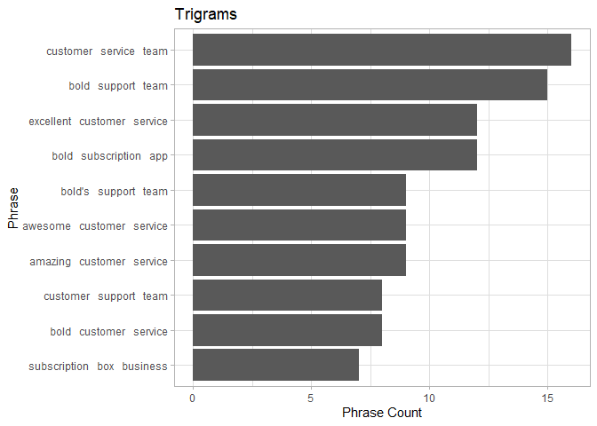

## Outline

This project is an study on the reviews from the Bold Commerce subscription app on Shopify. The reviews were scraped on 27-05-2020. 

The objective of this study is to glean an understanding into what customers are saying about the app, in an effort to identify an areas where the app is succeding and where it could be improved. 


## First Steps

Libraries required:

```r
library(tidyverse)
library(tidytext)
```

Initial Theme Set:

```r
theme_set(theme_light())
```


## EDA

Let's first read in our data files. These data files were scraped directly from the shopify review pages for the Bold Commerce subscription app. The reviews were cleaned in the data_cleaning.R file. The clean data is what we will be working with. 


```r
scraped_reviews_clean <- readRDS("scraped_reviews_clean.RDS")

scraped_reviews_clean %>% head(5) %>% knitr::kable(col.names = c(" Page Number", 
    "Stars", "Date Posted", "Review", "Review ID"))
```


  Page Number   Stars  Date Posted   Review                                                                                                                                                                                                                                                                                                                                                                                    Review ID
-------------  ------  ------------  ---------------------------------------------------------------------------------------------------------------------------------------------------------------------------------------------------------------------------------------------------------------------------------------------------------------------------------------------------------------------------------------  ----------
            1       2  2020-05-27    We have had the app for over a month now. We have had multiple issues with the app. The chat service is there but not able to resolve most issues . They have to be escalated and then may get a delayed response. We have had issues since the launch of our subscription that has still not been resolved. I would be prepared for issues if you have a more than a few subscribers.            1
            1       5  2020-05-27    Great app with awesome support. Quick to answer my questions anytime I reach out. Lots of Customization options. Thanks Priyanka for helping make my store checkout user friendly.                                                                                                                                                                                                                2
            1       5  2020-05-26    Great app, generally easy to use, lots of functionality. Excelent service (especially Aryan) that's right in the app, and quite responsive!                                                                                                                                                                                                                                                       3
            1       5  2020-05-26    I was having trouble installing it, then reached out to customer service. Carter helped me along with answering some of my questions regarding subscription. thank you so much!                                                                                                                                                                                                                   4
            1       5  2020-05-26    Great customer service. So easy to use, and analytics are fantastic.  Super simple to set up. I'd recommend it to anyone with a consumable product, and I will use it again... for sure.                                                                                                                                                                                                          5


We have  ``1644`` unqiue reviews, with the first review issued at ``2015-01-23`` and the newest review, as of time of scraping, posted on ``2020-05-27``


Lets see what the distribution is for ratings. 


```r
scraped_reviews_clean %>% count(stars) %>% knitr::kable(caption = "Count of stars", 
    col.names = c("Stars", "Count"))
```


Table: Count of stars

 Stars   Count
------  ------
     1      57
     2      14
     3      23
     4      84
     5    1466

We can clearly see that the vast majority of reviewers thought that the app was worthy of the top rating available. 


This is interesting, but lets see if we can tease out the some more insights from these reviews. We do this by taking the reviews the scraped reviews and using the ```tidytext``` package to transform them into a usable form. This results in the reviews being broken down into a tidy dataset that can be counted, grouped and analyzed. This has been done in the cleaning script located in the github. We will read in this tidy data set. 


```r
tidy_reviews <- readRDS("tidy_reviews.RDS")


tidy_reviews %>% head(10) %>% knitr::kable(col.names = c("Page Number", "Stars", 
    "Date Posted", "Review ID", "Word"))
```


 Page Number   Stars  Date Posted    Review ID  Word      
------------  ------  ------------  ----------  ----------
           1       2  2020-05-27             1  app       
           1       2  2020-05-27             1  month     
           1       2  2020-05-27             1  multiple  
           1       2  2020-05-27             1  issues    
           1       2  2020-05-27             1  app       
           1       2  2020-05-27             1  chat      
           1       2  2020-05-27             1  service   
           1       2  2020-05-27             1  resolve   
           1       2  2020-05-27             1  issues    
           1       2  2020-05-27             1  escalated 


We've taken the review text for all reviews; broken them into single words, removed puncuation, and converted everything into lowercase. We've placed these words into a ```word``` column replacing the previous ```review```  column from the ```scraped_reviews_clean``` dataset. We've also removed stop words from the ```tidy_text``` data set. Stop words are common words that are in lots of different sentances. Words such as "the", "a", "an" or "in", are examples of these. Were we to leave these types of words, they would dominate any further analysis that we would do. 


Let take a look at our most common words from all reviews


```r
tidy_reviews %>% count(word, sort = TRUE) %>% head(20) %>% mutate(word = reorder(word, 
    n)) %>% ggplot(aes(word, n)) + geom_col() + coord_flip() + ylab(NULL) + labs(title = "Word Count", 
    subtitle = "Most used words from all reviews")
```

<!-- -->

Looking at this chart we can see some positive insights. Words like easy, helpful and love are being used quite frequently. 
This chart can be misleading though. Because of the prevalance of 5 star reviews, we would expect an over representation of positive words in this chart. We can try and tease out some insights into the more negative reviews by seperating the negatively reviews from the positive reviews. We can use the ```star``` rating to do this. Lets group our reviews into 2 groups. The ```negative``` group represented by ```star``` ratings of 1,2 & 3. Our ```positive``` group will be represented by ```star ``` ratings of 4 and 5. We have also removed words ```bold``` and ```app```. These words were common, and can be considered stop words for this excerise. 


```r
tidy_grouped <- tidy_reviews %>% mutate(review_group = as.factor(if_else(stars %in% 
    c(1, 2, 3), "negative", "positive")))

p_grouped_positive <- tidy_grouped %>% filter(review_group == "positive", !word %in% 
    c("app", "bold")) %>% count(word, sort = TRUE) %>% head(10) %>% mutate(word = fct_reorder(word, 
    n)) %>% ggplot(aes(word, n)) + geom_col(fill = "green") + coord_flip() + labs(ylab = "Count", 
    title = "Positive")


p_grouped_negative <- tidy_grouped %>% filter(review_group == "negative", !word %in% 
    c("app", "bold")) %>% count(word, sort = TRUE) %>% head(10) %>% mutate(word = fct_reorder(word, 
    n)) %>% ggplot(aes(word, n)) + geom_col(fill = "red") + coord_flip() + labs(ylab = "Count", 
    title = "Negative")

gridExtra::grid.arrange(p_grouped_negative, p_grouped_positive, ncol = 2)
```

<!-- -->

Looking at these two graphs, we can clearly a dichotomy. The positive reviews contained words such as easy and helpful. Looking at our negative reviews, we see issue(s) pop up frequently. 

Interestingly we don't see an outright negative in the same way that we see outright positives such as easy and helpful. Perhaps this is because some words are preceded by qualifiers such as **not**. We will explore this in the next section. 


## N Grams

N grams are in essence phrase counts. In the previous section we looked at the count of a singular word. N grams take this one step further by taking multiple words together and counting them. 


We use the following code to build out our bi-grams and tri-grams.


```r
bigram <- scraped_reviews_clean %>% unnest_tokens(bigram, review_text, token = "ngrams", 
    n = 2)

bigram_sep <- bigram %>% separate(bigram, c("word1", "word2"), sep = " ")
```


```r
trigram <- scraped_reviews_clean %>% unnest_tokens(trigram, review_text, token = "ngrams", 
    n = 3)


trigram_sep <- trigram %>% separate(trigram, c("word1", "word2", "word3"), sep = " ")
```

The same problem with stop words arrises in n-grams as does when we look at single words. We can solve this by removing stop words once again. 


```r
stopwords <- stop_words$word

bigram_sep %>% filter(!word1 %in% stopwords) %>% filter(!word2 %in% stopwords) %>% 
    count(word1, word2, sort = TRUE) %>% mutate(joined = paste(word1, " ", word2), 
    joined = reorder(joined, n)) %>% head(10) %>% ggplot(aes(joined, y = n)) + geom_col() + 
    coord_flip() + labs(title = "Bigrams", y = "Phrase Count", x = "Phrase")
```

<!-- -->

```r
trigram_sep %>% filter(!word1 %in% stopwords) %>% filter(!word2 %in% stopwords) %>% 
    filter(!word3 %in% stopwords) %>% count(word1, word2, word3, sort = TRUE) %>% 
    mutate(joined = paste(word1, " ", word2, " ", word3), joined = reorder(joined, 
        n)) %>% head(10) %>% ggplot(aes(joined, y = n)) + geom_col() + coord_flip() + 
    labs(title = "Trigrams", y = "Phrase Count", x = "Phrase")
```

<!-- -->

Looking at both our bi and tri-grams we can see a very positive reception to the app. Phrases such as ***super helpful*** and *** amazing customer service*** are prevelant. We would expect positive messages like these to dominate this analysis as we saw that the vast majority of reviews were highly positive. 


Lets filter out those positive messages, and only look at the negatives. This will give us an understanding of what issues we are seeing arrise in the negative messages. We can use the same methadology as the singular word reivew, by assuming that a star rating of 3 or less indicates a negative review. 


```r
bigram_sep %>% filter(!word1 %in% stopwords, !word2 %in% stopwords, stars %in% c(1, 
    2, 3)) %>% count(word1, word2, sort = TRUE) %>% mutate(joined = paste(word1, 
    " ", word2), joined = reorder(joined, n)) %>% head(10) %>% ggplot(aes(joined, 
    y = n)) + geom_col() + coord_flip() + labs(title = "Bigrams", y = "Phrase Count", 
    x = "Phrase")
```

<!-- -->

The issue with filtering to the negative reviews only is that because there are so few of them, our analysis will be limited. That said, we do see that 5 seperate negative reviews mentioned tech support and live chats within their reviews. It may be worth while for Bold Commerce to take a look at these reviews to gain an understanding as to why these aspects of the app were mentioned with the negative reviews. 


## Word Cloud

Word clouds are hot right now. They are an easy way to visualize text, with the larger the word, the more frequently it appears. Lets take a look at a word cloud generated from these reviews.


```r
library(wordcloud2)
tidy_review_word_count <- tidy_reviews %>% filter(!word %in% c("bold", "app"), !str_detect(word, 
    "^[0-9]+$")) %>% count(word, sort = TRUE)

set.seed = 1234
wordcloud2(tidy_review_word_count, shape = "circle")
```


